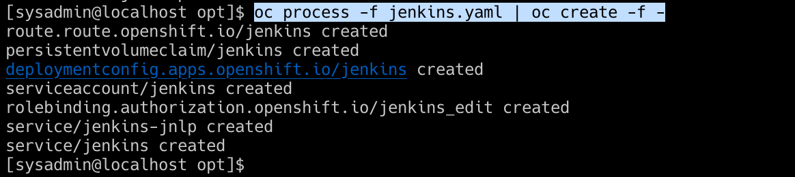
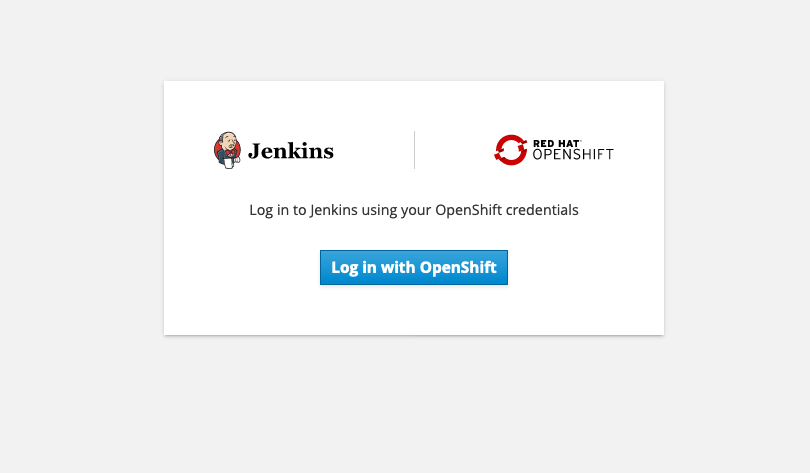

Lowe's
================

# Lowe's

### Cluster Endpoint: <https://zen-cpd-zen.apps.pwh.ocp.csplab.local/zen/#/homepage>

***Credentials Provisioned on Request***

### Jenkins Service Endpoint: <https://jenkins-openshift.apps.pwh.ocp.csplab.local/>

***Use the kubeadmin account.***

## Jenkins Pipeline for ML models on Cloud Pak for Data

\================

# Solution Description:

-----

## Solution Description:

A Continous Delivery Integration Pipeline to manage MLOps workflows. The
Pipeline will consist of a bitbucket or git repository storing source
code for a machine learning model. Commits will trigger a container
image build that will be deployed on an OCP cluster running Cloud Pak
for Data. The Container will run code to 1. Store a machine learning
model in a WML repository, create a deployment in WML for the model,
create an openscale subscription for the model, score the model against
target data set, return the quality metrics reported by openscale and
then cleanup.

### Architecture Diagram

<!-- -->

# Schedule

| day       | task                           | status    |
| :-------- | :----------------------------- | :-------- |
| Monday    | Install Jenkins                | Completed |
| Tuesday   | Deploy Hello World Application | Completed |
| Wednesday | Deploy ML Model                | Completed |
| Thursday  | Deploy OS Subscription         | pending   |
| Friday    | Containerize                   | Completed |

## Issue

| issue         | description                                                                                                                                                    | status     |
| :------------ | :------------------------------------------------------------------------------------------------------------------------------------------------------------- | :--------- |
| Training Data | In order to verify a succeful deployment the wmlpipeline class will need ability to access training data. How do we give the pipeline access to training data? | unresolved |
| LoadingModels | Need to test storing an in memory model in the WML repository - if the model is in memory do I need to provide metadata                                        | unresolved |

## Project Structure

``` project
|   README.md
|   Dockerfile
|   pipeline/
|    | -__init__.py
|    | - main.py # This will be the run file that defines how the program gets executed
|   src/
|    | - ___init__.py
|    | - wml.py
|    | - aios.py
|   model/
|     | - __init__.py
|     | -  model.py
|     | -  config.json
|     | -  train.py
|     | -  test.py
```

***Top Level*** In the top level we have a README.md, a Dockerfile,
requirements.txt and a License.

***Pipeline***

The Pipeline package includes main.py, a run file that defines how the
program gets executed. In the subdirectories are the modules containing
the classes and related methods used by main.py. These are split into
two interdependent submodules - wml and aios.

***Model***

The pipeline package access the model by importing it and insantiating
it through a function call. Therefore, for the program to run properly,
the datascientist must provide a model.py file that can be imported by
the main package and instantiated into memory.

You can see the import statement in the pipeline package **init**.py
file.

    from pipeline.model.train import train
    from pipeline.src import wml, aios
    from pipeline.model import model
    
    # if somebody does "from somepackage import *", this is what they will
    # be able to access:
    __all__ = [
        'train',
        'wml',
        'aios',
        'model'
    ]

An example model.py file is here

    import pickle
    
    #
    # Create your model here (same as above)
    #
    
    # Save to file in the current working directory
    def model(pkl_filename):
    
    # Load from file
      with open(pkl_filename, 'rb') as file:
        pickle_model = pickle.load(file)
      return model

In this example the actual model is contained in a pickle file and
loaded into memory. Pickle files are python code serialized into a
character stream. However the data scientist may employ any number of
methods for retrieving the actual model so long as the code contained in
the model function call will run inside the container. Keep in mind that
if you choose to use some method of retrieving the model from external
storage, ensure that networking in the deployment environment is set up
to allow for communicability with the external servers.

The Datascientist will also have to provide a requirements.txt with any
python packages that need to be installed to enable model.py to run.

## Dependencies

This project uses the ibm-watson-machine-learning version 1.0.5 python
SDK as a dependency Note that two earlier versions of the WML client
have been deprecated. The current release documentation is here:

<http://ibm-wml-api-pyclient.mybluemix.net/>
<https://github.com/IBM/watson-machine-learning-samples/tree/master/notebooks/python_sdk>
\#\# Deploying Jenkins on Openshift 4.3

This project uses Cloud Pak for Data on Openshift 4.3.5. In order to
build our Jenkins CDI Pipeline, we will need a jenkins server. The
Jenkins server is responsible for monitoring the repository for commits
and performing the builds and deployments of our applications. You can
deploy and run a Jenkins server anywhere however, as the container does
not need to run on the same cluster as Cloud Pak for Data. The following
instructions for installing a Jenkins server assume access to an
Openshift4.x cluster

1.  `oc project openshift` - change to the openshift project, which
    contains some templates for deploying jenkins
2.  `oc get templates | grep jenkins` - look for the jenkins-persistent
    template
3.  `oc get template jenkins-persistent -o yaml > jenkins.yaml` - output
    the template to a yaml file so that we can update the required
    parameters
4.  `oc process --parameters -f jenkins.yaml` - check the paramaters for
    anything you may want to change. Defaults are set for each of the
    parameters, so its not necessary to pass any values to the
    paramaters if you are comfortable with the defaults.
5.  `oc process -f jenkins.yaml | oc create -f -` - create the jenkins
    service 
6.  `oc get pods` - check that the jenkins service is running
7.  `oc get routes` - get the external route for the newly created
    jenkins service
8.  Navigate to the jenkins service and login with your openshift
    credentials

 \#\# Configuring Jenkins to Communicate with
Kubernetes

Jenkins supports a number of ‘agents’. An agent is an executor for a
pipeline. Supported executors include docker, node, kubernetes. Docker
and Kubernetes are considered ‘Cloud agents’ By default deploying
Jenkins on Openshift you have access to the Kubernetes Cloud as an agent
for running jenkins for Jenkins jobs. 1. Ensure all plugins,
particularly the Kubernetes plugin, are up to date. 2. Navigate to
Manager Jenkins, System Configuration -\> Cloud Providers -\>
Kubernetes. You will see that you have a Kubernetes cloud provider
already configured as an agent to run Jenkins job. However the name tag
(with the value openshift) may interfere with jenkins ability to find
the agent. Change ‘openshift’ to kubernetes and run a sample pipeline to
confirm that Jenkins can communicate with Openshift.

## Model Scoring

Model Scoring and testing is supported using project\_lib to fetch
training data from a connection or file. The data asset must be
available on Cloud Pak for Data to enable scoring. In the following
example we use the training data set to create a data asset on CP4D that
can be used to score the model.

    import pandas as pd
    from sklearn import datasets
    
    digits = datasets.load_digits()
    
    training_data = pd.DataFrame(digits.data[:-1])
    
    training_data.to_csv('training_data.csv', index=False)
    
    from ibm_watson_machine_learning import APIClient
    
    client = APIClient({"username":"admin","password":"password", "url": "https://zen-cpd-zen.apps.pwh.ocp.csplab.local", "instance_id":"wml_local", "version ":"3.0.1"})
    
    client.data_assets.create('training_data.csv', 'training_data.csv')
    
    client.data_assets.list()

### NOTE

When exporting a dataset to a dataframe, the python pandas library will
automatically include an index column in the dataset, which if included
will interfere with scoring. Make sure that the target dataset it
exported without an index.

## Jenkins Script using the cpdctl command line interface.

1.  Add a user to the cpdctl cli

`cpdctl config users set qa-user --username=<username>
--password=<password>`

2.  Add the cluster with the url `cpdctl config clusters set qa-cluster
    --user qa-user --url <cluster_url>`
3.  \`add the context

