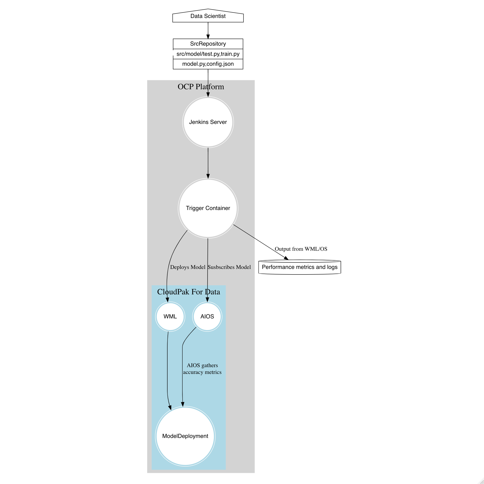

MLOPS with Jenkins, Watson Machine Learning and Watson Openscale
================

\================

# Solution Description:

-----

## Introduction:

A Continous Delivery Integration Pipeline to manage MLOps workflows. The
Pipeline will consist of a bitbucket or git repository storing source
code for a machine learning model. Commits will trigger a container
image build that will be deployed on an OCP cluster running Cloud Pak
for Data. The Container will run code to 1. Store a machine learning
model in a WML repository, create a deployment in WML for the model,
create an openscale subscription for the model, score the model against
target data set, return the quality metrics reported by openscale and
then cleanup.

### Architecture Diagram

<!-- -->

## Running the Jenkins pipeline- two options

1.  Create a python script or program that can be called to run the
    various steps using the WML python sdk.
2.  Use CPDCTL to write the pipeline steps in the Jenkins file.

## Project Structure for python script

``` project
|   README.md
|   Dockerfile
|   pipeline/
|    | -__init__.py
|    | - main.py # This will be the run file that defines how the program gets executed
|   src/
|    | - ___init__.py
|    | - wml.py
|    | - aios.py
|   model/
|     | - __init__.py
|     | -  model.py
|     | -  config.json
|     | -  train.py
|     | -  test.py
```

***Top Level*** In the top level we have a README.md, a Dockerfile,
requirements.txt and a License.

***Pipeline***

The Pipeline package includes main.py, a run file that defines how the
program gets executed. In the subdirectories are the modules containing
the classes and related methods used by main.py. These are split into
two interdependent submodules - wml and aios.

***Model***

The pipeline package access the model by importing it and insantiating
it through a function call. Therefore, for the program to run properly,
the datascientist must provide a model.py file that can be imported by
the main package and instantiated into memory.

You can see the import statement in the pipeline package **init**.py
file.

    from pipeline.model.train import train
    from pipeline.src import wml, aios
    from pipeline.model import model
    
    # if somebody does "from somepackage import *", this is what they will
    # be able to access:
    __all__ = [
        'train',
        'wml',
        'aios',
        'model'
    ]

An example model.py file is here

    import pickle
    
    #
    # Create your model here (same as above)
    #
    
    # Save to file in the current working directory
    def model(pkl_filename):
    
    # Load from file
      with open(pkl_filename, 'rb') as file:
        pickle_model = pickle.load(file)
      return model

In this example the actual model is contained in a pickle file and
loaded into memory. Pickle files are python code serialized into a
character stream. However the data scientist may employ any number of
methods for retrieving the actual model so long as the code contained in
the model function call will run inside the container. Keep in mind that
if you choose to use some method of retrieving the model from external
storage, ensure that networking in the deployment environment is set up
to allow for communicability with the external servers.

The Datascientist will also have to provide a requirements.txt with any
python packages that need to be installed to enable model.py to run.

## Dependencies

This project uses the ibm-watson-machine-learning version 1.0.5 python
SDK as a dependency Note that two earlier versions of the WML client
have been deprecated. The current release documentation is here:

<http://ibm-wml-api-pyclient.mybluemix.net/>
<https://github.com/IBM/watson-machine-learning-samples/tree/master/notebooks/python_sdk>
\#\# Deploying Jenkins on Openshift 4.3

This project uses Cloud Pak for Data on Openshift 4.3.5. In order to
build our Jenkins CDI Pipeline, we will need a jenkins server. The
Jenkins server is responsible for monitoring the repository for commits
and performing the builds and deployments of our applications. You can
deploy and run a Jenkins server anywhere however, as the container does
not need to run on the same cluster as Cloud Pak for Data. The following
instructions for installing a Jenkins server assume access to an
Openshift4.x cluster

1.  `oc project openshift` - change to the openshift project, which
    contains some templates for deploying jenkins
2.  `oc get templates | grep jenkins` - look for the jenkins-persistent
    template
3.  `oc get template jenkins-persistent -o yaml > jenkins.yaml` - output
    the template to a yaml file so that we can update the required
    parameters
4.  `oc process --parameters -f jenkins.yaml` - check the paramaters for
    anything you may want to change. Defaults are set for each of the
    parameters, so its not necessary to pass any values to the
    paramaters if you are comfortable with the defaults.
5.  `oc process -f jenkins.yaml | oc create -f -` - create the jenkins
    service 
6.  `oc get pods` - check that the jenkins service is running
7.  `oc get routes` - get the external route for the newly created
    jenkins service
8.  Navigate to the jenkins service and login with your openshift
    credentials

 \#\# Configuring Jenkins to Communicate with
Kubernetes

Jenkins supports a number of ‘agents’. An agent is an executor for a
pipeline. Supported executors include docker, node, kubernetes. Docker
and Kubernetes are considered ‘Cloud agents’ By default deploying
Jenkins on Openshift you have access to the Kubernetes Cloud as an agent
for running jenkins for Jenkins jobs. 1. Ensure all plugins,
particularly the Kubernetes plugin, are up to date. 2. Navigate to
Manager Jenkins, System Configuration -\> Cloud Providers -\>
Kubernetes. You will see that you have a Kubernetes cloud provider
already configured as an agent to run Jenkins job. However the name tag
(with the value openshift) may interfere with jenkins ability to find
the agent. Change ‘openshift’ to kubernetes and run a sample pipeline to
confirm that Jenkins can communicate with Openshift.

## Model Scoring

Model Scoring and testing is supported using project\_lib to fetch
training data from a connection or file. The data asset must be
available on Cloud Pak for Data to enable scoring. In the following
example we use the training data set to create a data asset on CP4D that
can be used to score the model.

    import pandas as pd
    from sklearn import datasets
    
    digits = datasets.load_digits()
    
    training_data = pd.DataFrame(digits.data[:-1])
    
    training_data.to_csv('training_data.csv', index=False)
    
    from ibm_watson_machine_learning import APIClient
    
    client = APIClient({"username":"admin","password":"password", "url": "https://zen-cpd-zen.apps.pwh.ocp.csplab.local", "instance_id":"wml_local", "version ":"3.0.1"})
    
    client.data_assets.create('training_data.csv', 'training_data.csv')
    
    client.data_assets.list()

### NOTE

When exporting a dataset to a dataframe, the python pandas library will
automatically include an index column in the dataset, which if included
will interfere with scoring. Make sure that the target dataset it
exported without an index.

## Option 2: Jenkins Script using the cpdctl command line interface.

When using the kubernetes plugin, we can run pipeline steps inside of a
kubernetes pod. We do this by specifying the kubernetes agent with the
yaml embedded. In this case notice that I reference a custom image
stored in the internal image repository of the openshift cluster where I
have Jenkins deployed

    // Uses Declarative syntax to run commands inside a container.
    def SPACE_NAME
    def MODEL_ID
    def SPACE_ID
    def DELETED_SPACES
    def SPACES=0
    def Values
    pipeline {
        agent {
            kubernetes {
                // Rather than inline YAML, in a multibranch Pipeline you could use: yamlFile 'jenkins-pod.yaml'
                // Or, to avoid YAML:
                // containerTemplate {
                //     name 'shell'
                //     image 'ubuntu'
                //     command 'sleep'
                //     args 'infinity'
                // }
                yaml '''
    apiVersion: v1
    kind: Pod
    spec:
      containers:
      - name: shell
        image:  image-registry.openshift-image-registry.svc:5000/openshift/mlopspipeline:latest
        command:
        - sleep
        args:
        - infinity
    '''
                // Can also wrap individual steps:
                // container('shell') {
                //     sh 'hostname'
                // }
                defaultContainer 'shell'
            }
        }

In the setup stage I configure the cpdctl cli to interact with my CP4D
Cluster. - reference the CPDCTL repository for more details about cpdctl
commands <https://github.com/IBM/cpdctl>.

``` 
    environment{
        MODEL_NAME='mlopsmodel'
    }

    stages {
        stage('Setup') {
            
            steps {
               
      
                sh 'echo "Setting up cluster context"'
                sh 'cpdctl config users set qa-user --username=admin --password=password'
                sh 'cpdctl config profiles set qa-cluster --user qa-user --url https://zen-cpd-zen.apps.pwh.ocp.csplab.local'
                sh 'cpdctl config contexts set qa-context --profile qa-cluster'
                sh 'cpdctl config contexts use qa-context'
                
                

                script{
                    env.SPACE_NAME="p-test-space"
                    env.DEPLOY_NAME="p-test-deploy"
                    env.SPACE_ID=sh(returnStdout: true, script:"cpdctl spaces list | grep ${env.SPACE_NAME} | awk '{ print \$1}'").trim()
                    
                   
                }
               

            }
        }
```

In the deployment space setup stage I target the appropriate WML
namespace based on environment variables I set at the top of the Jenkins
file Then I update the model binary in the WML repo with the binary
stored in the Git repository, as well as update the model deployment.

``` 
        stage('Deployment space setup') {
            steps{ 


            script{
                env.SPACES=sh(returnStdout: true, script:" cpdctl spaces list | grep ${env.SPACE_NAME} | awk 'END{print NR}'  ").trim()

       

                if(env.SPACES>1){
                    echo "Deleting extra spaces"
                    

                    env.DELETED_SPACES=sh(returnStdout:true, script:   "cpdctl spaces list | grep ${env.SPACE_NAME} | awk 'NR>1{print \$1}' | xargs -I{} cpdctl spaces delete --space-id {}").trim()
                    echo "${env.DELETED_SPACES}"
                }
                if(env.SPACES==0){
                    env.CREATED_SPACE=sh(returnStdout: true, script: "cpdctl spaces create --name ${env.SPACE_NAME}").trim()
                    sh 'printenv'
                }
                    env.SPACE_ID=sh(returnStdout: true, script:"cpdctl spaces list | grep ${env.SPACE_NAME} | awk '{ print \$1}'").trim()
                    echo "${env.SPACE_ID}"
                


            }              
              
                             }
        }
        stage('Update model'){
            steps{

                script{

                    env.MODELS = sh(returnStdout: true, script: "cpdctl wml models list --space-id ${env.SPACE_ID} | grep  ${env.MODEL_NAME} |  awk 'END {print NR}' ").trim()

                    if(env.MODELS==1){
                        env.MODEL_ID=sh(returnStdout: true, script: "cpdctl wml models list --space-id ${env.SPACE_ID} | grep mlopsmodel | awk '{ print \$1}' ").trim()
                        env.MODEL_CONTENT=sh(returnStdout: true, script:  " cpdctl wml models upload-content --body notebooks/mlopsmodelpipeline.tar.gz --model-id ${env.MODEL_ID} --content-format 'binary' --space-id ${env.SPACE_ID} --output json  "  ).trim()

                    }else{
                        env.NEW_MODEL=sh(returnStdout: true, script: "cpdctl wml models create --name mlopsmodel --space-id ${env.SPACE_ID} --software-spec '{\"name\": \"scikit-learn_0.22-py3.6\"}' --type 'scikit-learn_0.22'").trim()
                        env.MODEL_ID = sh(returnStdout: true, script: "cpdctl wml models list --space-id ${env.SPACE_ID} | grep mlopsmodel | awk '{ print \$1}' ").trim()
                        env.MODEL_CONTENT=sh(returnStdout: true, script:  " cpdctl wml models upload-content --body notebooks/mlopsmodelpipeline.tar.gz --model-id ${env.MODEL_ID} --content-format 'binary' --space-id ${env.SPACE_ID} --output json  "  ).trim()


                    }


                }
               
                //notice we can update parameters defining the model
```

``` 

            }
        }
        stage('Update Deployment'){
            steps {
              

              script{
                env.deployments=sh(returnStdout: true, script: "cpdctl wml deployments list --space-id ${env.SPACE_ID} | awk 'NR>1' ;").trim()
                if (env.deployments == "Nothing to show."){
                    echo "Creating Deployment"
                    env.DEPLOY=sh(returnStdout: true, script: "cpdctl wml deployments create --name ${env.DEPLOY_NAME} --online '{\"description\": \"mlopsdeploy\"}' --asset '{\"id\": \"${env.MODEL_ID}\"}' --space-id ${env.SPACE_ID};").trim()
        


                }
                env.DEPLOY_ID=sh(returnStdout: true, script:"cpdctl wml deployments list --space-id ${env.SPACE_ID} | grep ${env.DEPLOY_NAME} | awk '{print \$1}'").trim()
                echo env.DEPLOY_ID
              }
                
            }
        }
```

Now I will update or create the WOS subscription

``` 
        stage('Create/Update WOS Subscription'){
            steps{

                script{

                    env.DEPLOY_URL=sh(returnStdout: true, script:"cpdctl wml deployments get --deployment-id ${env.DEPLOY_ID} --space-id ${env.SPACE_ID} --output yaml | grep https | awk '{print \$2}' " ).trim()
                    env.SERVICE_INSTANCE_ID=sh(returnStdout:true, script: " cpdctl wos service-providers list | awk 'NR>2 {print \$1}' ").trim()
                    env.DATA_MART_ID=sh(returnStdout: true, script:  "cpdctl wos data-marts list | awk 'NR>2{print \$1}'" ).trim()
                    env.URL=sh(returnStdout: true, script:   "echo  https://zen-cpd-zen.apps.pwh.ocp.csplab.local/v4/models/${env.MODEL_ID}?space_id=${env.SPACE_ID}  ").trim()
                    env.ASSET=sh(returnStdout:true, script: "echo \"{\\\"asset_id\\\":\\\"${env.MODEL_ID}\\\", \\\"asset_type\\\":\\\"model\\\" ,\\\"problem_type\\\":\\\"multiclass\\\", \\\"input_data_type\\\":\\\"structured\\\", \\\"url\\\":\\\"${env.URL}\\\", \\\"name\\\": \\\"${env.DEPLOY_NAME}\\\" }\">notebooks/asset.json").trim()
                    env.DEPLOYMENT=sh(returnStdout:true, script: "echo \"{\\\"deployment_id\\\":\\\"${env.DEPLOY_ID}\\\", \\\"deployment_type\\\":\\\"online\\\", \\\"name\\\":\\\"${env.DEPLOY_NAME}\\\", \\\"url\\\": \\\"${env.DEPLOY_URL}\\\", \\\"scoring_endpoint\\\":{ \\\"request_headers\\\": { \\\"Content-Type\\\": \\\"application/json\\\"}, \\\"url\\\":\\\"${env.DEPLOY_URL}\\\"}, \\\"service_provider_id\\\": \\\"fedb2dcd-1771-4705-88a1-b791a0bf5833\\\"}\">notebooks/deployment.json").trim()
                    env.ASSET_PROPERTIES=sh(returnStdout: true, script: "cat notebooks/asset_properties.json").trim()
                    
                    env.SUBSCRIPTION_ID=sh(returnStdout: true, script: "python3 -c 'import json, sys; subList=[x.get(\"metadata\").get(\"id\") for x in json.loads(sys.argv[1]).get(\"subscriptions\") if x.get(\"entity\").get(\"deployment\").get(\"name\") ==sys.argv[2] ]; print(subList[0] if len(subList)==1 else None)' \"`cpdctl wos subscriptions list --output json`\"  \"${env.DEPLOY_NAME}\" ").trim()


                }
                script{

                    if( env.SUBSCRIPTION_ID=="None"){
                        echo "Subscription not found"
                        sh(returnStdout:true, script:" cpdctl wos subscriptions add --asset \"`cat notebooks/asset.json`\" --deployment \"`cat notebooks/deployment.json`\" --data-mart-id \"${env.DATA_MART_ID}\" --service-provider-id \"${env.SERVICE_INSTANCE_ID}\" --asset-properties \"`cat notebooks/asset_properties.json`\" ").trim()
                        sleep(10)
                        env.SUBSCRIPTION_ID=sh(returnStdout: true, script: "python3 -c 'import json, sys; subList=[x.get(\"metadata\").get(\"id\") for x in json.loads(sys.argv[1]).get(\"subscriptions\") if x.get(\"entity\").get(\"deployment\").get(\"name\") ==sys.argv[2] ]; print(subList[0] if len(subList)==1 else None)' \"`cpdctl wos subscriptions list --output json`\"  \"${env.DEPLOY_NAME}\" ").trim()
                        sh(returnStdout:true, script: "python3 -c 'import sys; from ibm_ai_openscale import APIClient4ICP; client = APIClient4ICP({\"username\":\"admin\", \"password\":\"password\", \"url\":\"https://zen-cpd-zen.apps.pwh.ocp.csplab.local\"}); print(client.data_mart.subscriptions.get(name=sys.argv[1]).payload_logging.enable(dynamic_schema_update=True))' \"${env.DEPLOY_NAME}\" ")
                        echo "Adding Configuration Information"
                        sh(returnStdout: true, script: " cpdctl wos subscriptions update --subscription-id ${env.SUBSCRIPTION_ID} --patch-document \"[`cat notebooks/configurations.json`]\" ").trim()


                    }else{

                    echo "Subscription found"
                    //echo "Deleting old subscription"
                    //sh(returnStdout: true, script: "cpdctl wos subscriptions delete --subscription-id ${env.SUBSCRIPTION_ID} ")
                    //sh(returnStdout: true, script: "cpdctl wos subscriptions add --asset \"${env.ASSET}\" --deployment \"${env.DEPLOYMENT}\" --data-mart-id \"${env.DATA_MART_ID}\" --service-provider-id \"${env.SERVICE_INSTANCE_ID}\" --asset-properties \"${env.ASSET_PROPERTIES}\"  ")
                    //sleep(10)
                    //sh(returnStdout: true, script: "python3 -c 'import sys; from ibm_ai_openscale import APIClient4ICP; client = APIClient4ICP({'username':'admin', 'password':'password', 'url':'https://zen-cpd-zen.apps.pwh.ocp.csplab.local'}); print(client.data_mart.subscriptions.get(name=sys.argv[1]).payload_logging.enable(dynamic_schema_update=True))'  \"${env.DEPLOYMENT}\" " )
                    sleep(5) 


                    }

                }

                script{

                    sleep(10)
                    catchError(buildResult: 'SUCCESS', stageResult: 'SUCCESS'){
                        sh(returnStdout: true, script: "cpdctl wos subscriptions update --subscription-id ${env.SUBSCRIPTION_ID} --patch-document \"[`cat notebooks/asset_properties.json`]\"  ").trim()
                        


                    } 
                    sleep(10)
                    sh(returnStdout: true, script: "cpdctl wos monitors instances add --data-mart-id ${env.DATA_MART_ID} --monitor-definition-id \"quality\" --parameters \'{\"min_feedback_data_size\":1, \"max_rows_per_evaluation\":150}' --target \'{\"target_id\":\"\'\"$SUBSCRIPTION_ID\"\'\", \"target_type\":\"subscription\"}\'  --thresholds \'[{\"metric_id\":\"accuracy\", \"type\":\"lower_limit\", \"value\":0.8}]\'"     )

                    //env.TOKEN=sh(returnStdout: true, script: "curl -k -X POST \'https://zen-cpd-zen.apps.pwh.ocp.csplab.local/icp4d-api/v1/authorize\'  -d \'{\"username\":\"admin\", \"password\":\"password\" }\' --header \'Accept: application/json\' --header \"Content-Type: application/json\" | grep token | tr -d \"{}\" | awk -F\":\" \'{ print \$4}\' | tr -d \"  " ).trim()
                    //env.SUBSCRIPTION_JSON=sh(returnStdout: true, script: " curl https://zen-cpd-zen.apps.pwh.ocp.csplab.local/v1/data_marts/${env.DATA_MART_ID}/service_bindings/${env.SERVICE_INSTANCE_ID}/subscriptions/${env.SUBSCRIPTION_ID}/file -k --header \"authorization: Bearer ${env.TOKEN}\" --header 'content-type: application/json'   ").trim()


                }


            }


        }
```

Then I score the model with some data from a csv file I have in the
repository, and create an instance of a quality monitor inorder to get
various quality metrics of the deployed model in Openscale

``` 

        stage('Score deployed model'){

            steps{
                script{
                env.VALUES=sh(returnStdout:true, script:   '''awk -F"," -v OFS="," 'NR>1500{ print $0  }' notebooks/datawoprob.csv | rev| cut -c 3- | rev | awk -F"," -v OFS="," '{printf t "["$0"]"}{t=", "}' '''  ).trim()
              
                sh(returnStdout: true, script: "python3 -c 'import sys,json; from ibm_ai_openscale import APIClient4ICP; APIClient4ICP({\"username\":\"admin\", \"password\":\"password\", \"url\":\"https://zen-cpd-zen.apps.pwh.ocp.csplab.local\" }).data_mart.subscriptions.get(name=sys.argv[1]).feedback_logging.store(json.loads(sys.argv[2]).get(\"values\") )' \"${env.DEPLOY_NAME}\" '{\"values\":[${env.VALUES}]}'  ")

                
               
                }
               
                sh ''' MONITOR_INSTANCE_ID=$(cpdctl wos monitors instances list | awk 'NR==3{print $1}')'''
                sh 'echo $MONITOR_INSTANCE_ID'
                sh '''cpdctl wos monitors runs add --monitor-instance-id $(cpdctl wos monitors instances list | awk 'NR==3{print $1}')'''
                sh '''cpdctl wos monitors runs get --monitoring-run-id $(cpdctl wos monitors runs list --monitor-instance-id $(cpdctl wos monitors instances list | awk 'NR==3{print $1}') | awk 'NR==3{print $1}')  --monitor-instance-id $(cpdctl wos monitors instances list | awk 'NR==3{print $1}') --output yaml'''
            }
        }
    }
}
```
